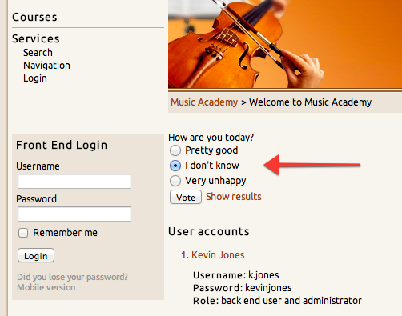

# Polls extension for Contao Open Source CMS

Polls is an extension for the [Contao Open Source CMS](https://contao.org).

Create and manage polls in Contao. It features single and multiple votes, poll protection, advanced behavior setup and more. 
It comes with an attractive backend interface - you can preview the percentage bar and browse all votes per each option.

## Documentation

[Read the documentation](docs/README.md)

## Copyright

This project has been created and is maintained by [Codefog](https://codefog.pl).
