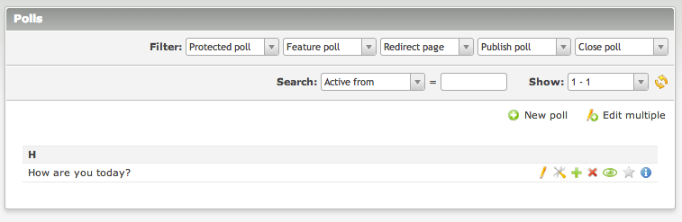
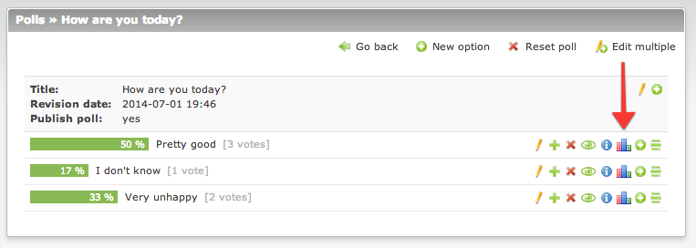
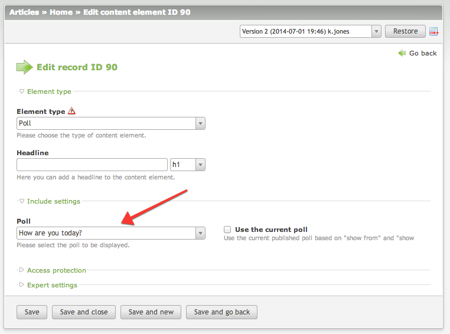
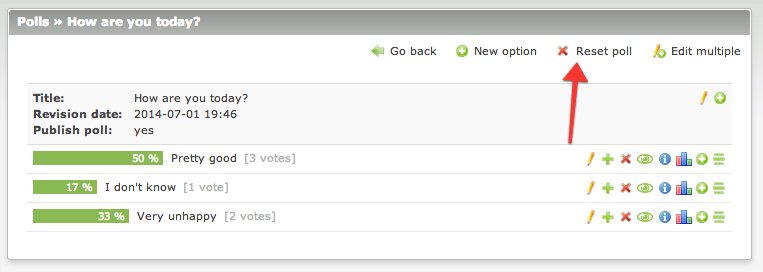

# Polls – Documentation

## Setup a poll

To setup a new poll go to the `Polls` module and create a new record. The poll configuration form has many options, 
but they are prefilled with the ready-to-use values.

Starting from the top, you can first choose the type of the poll. It can be a `single vote (radio)` or `multiple vote 
(checkbox)` poll. Next value that should be set is the `vote interval` - this is the time in seconds after which the user 
can vote again. The poll can be also protected as well as featured.

Next important thing is the behavior configuration. Here you have to set how the poll behaves after user has or has not 
voted. The most optimal behavior has been set as the default, but you can adjust it to your needs anytime.

To automate the publishing polls task, you can enter values in the special fields at the bottom: `show form and show until`. 
What's more, you can decide when the poll will be active (i.e. accepting votes) and when it should display the results.

Once you are done with the poll configuration, you have to create the poll options. Each option has the percentage bar 
displaying the current amount of the votes. You can also view and manage the votes using the `Votes` button in every row.

## Put on the website

When the poll is ready, you can put it on the website in two ways: content element or front end module. 
Configuration of both is the same - you can either choose the poll manually or let the script find the current one 
(based on poll settings).

There's also a front end module called `Poll list`. It can be used to generate the polls archive, list of the current polls, 
list of the featured polls, etc. Items can be limited and paginated as well.

## Reset the poll

After all tests you can easily reset all poll votes using the `Reset poll` button at the top of the page:

